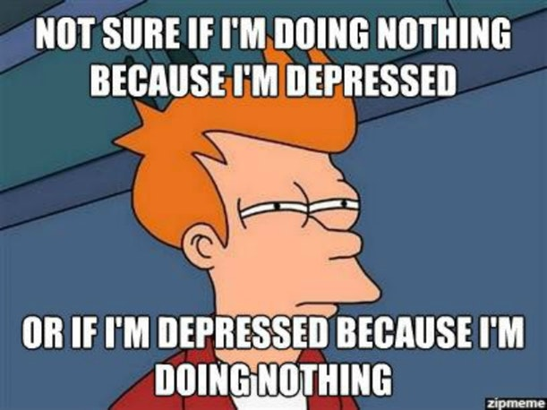
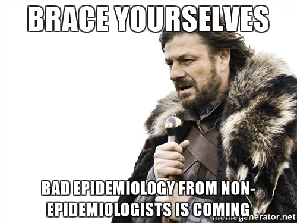

#Introduction to My Project

<br> My project topic for this semester was depression. Depression is something that I've struggled with since high school, and I wanted to use this project to learn some more about it. I won't be talking about everything that I've learned and done research on (because this project covered a really large amount of ground), so today I'm simply going to focus on the epidemiology of depression, as well as my own original study that I have been working on during the semester (that has to do with depression epidemiology). 


#Epidemiology 




 <br> There has been many, many epidemiological studies on depression, as mental health has become less taboo in western society. Depression itself is a wide-ranging disease that can affect anybody for any number of reasons. That being said, there is a greater chance of a person developing depression if they are a woman, a racial minority, or LGBT. Additionally, depression rates increase rapidly as children age in to adolescence. The reason that depression rates are more prevalent among these groups is because of a variety of environmental factors, such as sociocultural experiences, that in turn can influence a person’s neurological and genetic factors, and can lead to depression. 

<br> In my paper on derpession epidemiology, I explored some of these studies, specifically studies on women, LGBT people, and adolescents. In general, women and LGBT people were more likely to develop depression than their male and straight peers, which has to do with several environmental factors such as: misogyny in the workplace and the societal pressure to become a full-time homemaker for women; and fewer peer interactions and increased social isolation for LGBT people. These environmental factors therefore have a greater impact on these kids' biological and neurological mechanisms and can lead to depression. 

<br> Depression in adolescence is what I wanted to focus on in particular with this project, because there seems to be an increasing prevalence of adolescents with depression. I found a review that looked at exactly this, which determined from several studies done in the past few decades that the increased prevalence of adolescent depression is not something new. The thing that IS new is that more kids are getting recognized as having depression, and getting treatment for it, than were in the past. 

<br> From here, I'm going to segway in to my own data project, which has to deal with adolescent depression. 

#My Project!

<br>So, waaaay back when we were assigned to do a mini study with real data, I took it a bit to the next level. The question I asked was: Among adolescents, is there a specific factor (i.e. race, gender, socioeconomical) that makes these kids more prone to depression. I used the data that I found to look at this question, and was actually able to do a couple of really neat things with it using R. In fact, I made this entire HTML presentation in R! So now, I'll take you through a bit of a step-by-step walkthrough of  what I did. And yes, I will explain what you're looking at in layman's terms because I know you guys aren't too big on statistics. 


##The first steps I took

<br>I downloaded the data in an R data format directly off the [online data repository] (http://www.icpsr.umich.edu/icpsrweb/ICPSR/studies/36147?q=depression+adolescents&searchSource=find-analyze-home&dataFormat%5B0%5D=R&sortBy=&keyword%5B0%5D=mental+health&geography%5B0%5D=United+States&groupResults=false) I found it on. In this first code chunk, I am loading that data in to R. As you see, I am pulling data from four different datasets in to this study, because the data was split up in to several different data frames (this is because it is a LOT of data). 


```{r, results='hide'}
get(load(file = "36147-0003-Data.rda"))

get(load(file = "da36147.0005.rda"))

get(load(file = "da36147.0008.rda"))

get(load(file = "36147-0002-Data.rda"))

```

Now, I am concatenating the data in to one data frame (i.e. not only shoving all the data together, but aligning the data by the columns that the datasets have in common so the data for each person is aligned in one single row). I concatenated by household number, and by person number in that household. 
```{r, results='hide'}
library(dplyr)

newdata <- merge(da36147.0003, da36147.0005, by = c("HHX", "FPX"), all = TRUE)
head(newdata)

dep <- merge(newdata, da36147.0008, by = c("HHX", "FPX"), all = TRUE)


depr <- merge(dep, da36147.0002, all = TRUE)
#note that da36147.0002 didn't have the FPX variable. Not sure what that will do to our data until I filter out all the stuff I don't need. 

head(depr)
tail(depr)


```
##Cleaning up our data

<br>As you can see, now we got all the data in to one place, but there's still way too much of it! Now I will filter the data and pull out only the columns we need from the 1000-some columns that currently exist in the dataframe. I will do this using tidyr and dplyr. 

```{r}
library(dplyr)
library(tidyr)

#only selecting the columns I want
newdep <- select(depr, HHX, FPX, SEX.x, AGE_P.x, HISCODI3, PARENTS, MOM_ED, DAD_ED, RSCL3_E3, DEP_1)
head(newdep)

#I didn't select the income columns because they're giving me issues. (The one that I would like to use if I can get it is INCGRP3)

#merging the child depression columns and the adult depression columns 
newdep <- unite(newdep, DEPMAIN, c(RSCL3_E3, DEP_1), remove=TRUE)
head(newdep)

#filtering out only 10-24 year olds. This is the age range that the WHO gives as "adolescent"
newdep1 <- filter(newdep, AGE_P.x == c(10:24))
head(newdep1)

```

There's a few more things that I need to do to clean up my data... First, I'm going to transform the depression data I have in to 1's and 0's (i.e. if a person does have depression of ANY severity, they get a 1, and if they don't they get a 0). I'm going to do this by changing each depression value type individually, as you will see below. Just for shits and giggles, I also want to see how big my depressed sample is to make sure I don't have to choose my analyses with small sample sizes in mind. I'm gonna just filter all of the depressed people out and look at the total count after I transform the data. 

```{r}

#changing the values for all people with depression
newdep1$DEPMAIN[newdep1$DEPMAIN == "(1) Somewhat true_NA"] <- 1
newdep1$DEPMAIN[newdep1$DEPMAIN == "NA_(1) Daily"] <- 1
newdep1$DEPMAIN[newdep1$DEPMAIN == "(2) Certainly true_NA"] <- 1
newdep1$DEPMAIN[newdep1$DEPMAIN == "NA_(2) Weekly"] <- 1
newdep1$DEPMAIN[newdep1$DEPMAIN == "NA_(3) Monthly"] <- 1
newdep1$DEPMAIN[newdep1$DEPMAIN == "NA_(4) A few times a year"] <- 1

#changing the values for all people without depression
newdep1$DEPMAIN[newdep1$DEPMAIN == "NA_(5) Never"] <- 0
newdep1$DEPMAIN[newdep1$DEPMAIN == "NA_NA"] <- 0
newdep1$DEPMAIN[newdep1$DEPMAIN == "(0) Not true_NA"] <- 0

#filtering the depressed people just to see my depression sample size... which is 77! Perfect!
newdep2 <- filter(newdep1, DEPMAIN == 1)

```

The only thing to do now is get the income group data to align... I may just have to insert those manually at this point...

##Some actual analysis

<br>Right now, since I can't graph anything because the variables are all categorical, Poisson, or Binomial, I'm just gonna try out some quick and dirty regression models using my data to see if we get anything. What I'm looking for in these regressions is to see if depression is correlated with the variables such as sex and race and parents that I was able to pull out. Mainly, we're going to be looking at the P-values. 

```{r}
#baseline test
test0 <- lm(data = newdep1, DEPMAIN ~ 1)
summary(test0)

test1 <- lm(data = newdep1, DEPMAIN ~ SEX.x)
summary(test1)
#nothing significant...

test2 <- lm(data = newdep1, DEPMAIN ~ HISCODI3)
summary(test2)
#nothing significant...

test3 <-  lm(data = newdep1, DEPMAIN ~ PARENTS)
summary(test3)
#neither mother nor father is significant?.... hmmm....

test4 <-  lm(data = newdep1, DEPMAIN ~ MOM_ED)
summary(test4)
#nothing...

test5 <-  lm(data = newdep1, DEPMAIN ~ DAD_ED)
summary(test5)

#Interaction models, just to see...
test6 <-  lm(data = newdep1, DEPMAIN ~ HISCODI3+SEX.x)
summary(test6)
#nope

test7 <-  lm(data = newdep1, DEPMAIN ~ HISCODI3+PARENTS)
summary(test7)
#neither mother nor father is significant again??

test8 <-  lm(data = newdep1, DEPMAIN ~ SEX.x+PARENTS)
summary(test8)
#again "neither mother nor father" is the only one that is significant. 

test9 <-  lm(data = newdep1, DEPMAIN ~ HISCODI3*SEX.x)
summary(test9)

test10 <-  lm(data = newdep1, DEPMAIN ~ HISCODI3*PARENTS)
summary(test10)

```

So far this isnt looking great, but I think it's because the data all has non-continuous data. There are still a few things we can do to this though, like re-leveling our variables and using General Linear Models. So let's try that!

<br>First, let's try releveling. 

```{r}
newdep1$SEX.x <- relevel(newdep1$SEX.x, ref = "(2) Female")

#now the model
m <- lm(data = newdep1, DEPMAIN ~ SEX.x)
summary(m)

#Still nothing....  
```

We're getting not great P-values so I don't think we're using an appropriate model for the data, so let's try GLM. 

```{r}
newdep1$DEPMAIN <- as.numeric(newdep1$DEPMAIN)

glm <- glm(data = newdep1, DEPMAIN ~ SEX.x, family = "binomial")
summary(glm)

glm1 <- glm(data = newdep1, DEPMAIN ~ HISCODI3, family = "binomial")
summary(glm1)
```
As I'm seeing the results from this data not look as great as I want them to, there is just one thing that I want to point out about the data that I think might be affecting the outcomes. Because this data was collected via interview, all of the data for kids under 18 was supplied by their parents. I imagine that this resulted in a lot of under-reported depression incidence, either because parents didn't want to answer the questions, or they did not know that their children were depressed. At any rate, I hve the data that I have, and I can't really change anything about that now. 

In the interest of time, I'll stop doing linear models here, and talk about where I hope this project will go in the future. 


#Conclusions/Next Steps
<br> So, already I think I can see a few conclusions from this data that bring up some new qurstions and public policy suggestions: 
* First off, you would think that there would be a gender correlation with depression. Why isn't this happening in the data that I found? Does that mean that we don't have to watch out more for depression in adolescent girls in policy changes? 
* Second, you would also think that there would be a racial correlation with depression from my data. Why isn't there? Could this mean that we also dont have to watch out more for depression in minority kids? 
* Finally, out of everone, the only group with significant correlation to depression is kids without parents. Since the study only differentiated between kids with both parents, one parent, and no parents, how can we know if them being parentless arose from a traumatic condition or not? Should we resample this specific population to find out more, or could we work with schools and child services to inform them of this correlation? It's really up in the air as of right now how to take this on from a public policy standpoint. 

<br> What I've done so far I'm pretty proud of! But there is still some other analyses that I want to do, that I hope will turn in to something bigger. My next steps that I will take with this data are: 
* Residuals! Saving the residuals from a linear model can be useful, because they can tell you if there is an outside variable influencing your data that you're not seeing. I want to look at these residuals and see if they're normal or not. 
* Again with the residuals, I can also use them to adjust for "neither mother nor father", and look to see if in this population of kids who don't live with either their mother or father there are significant correlations between race and sex. 
* I could also just explore the correlation between kids with no parents more in general...
* More variables! There are more variables that I can look at to see if there's correlation between them and depression (such as income and socioeconomic class), but it's just a matter of getting them in to the data frame correctly. 

